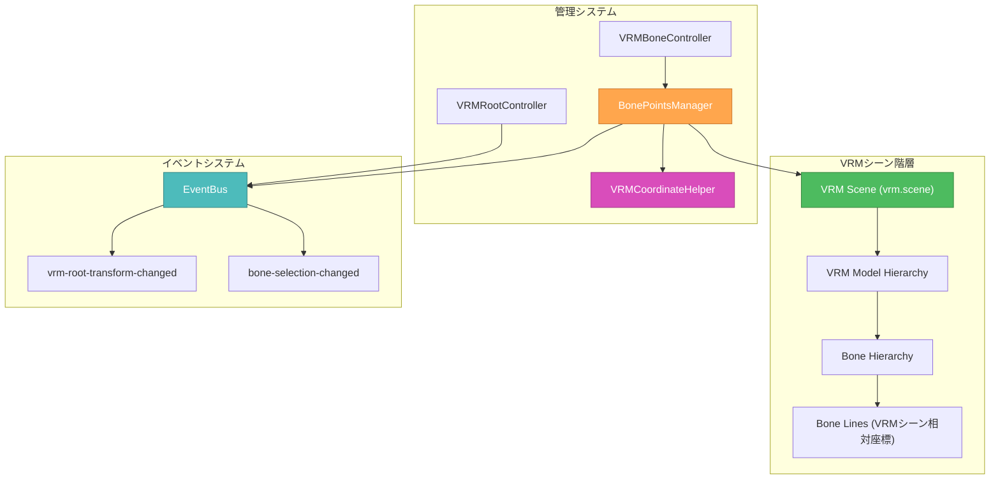
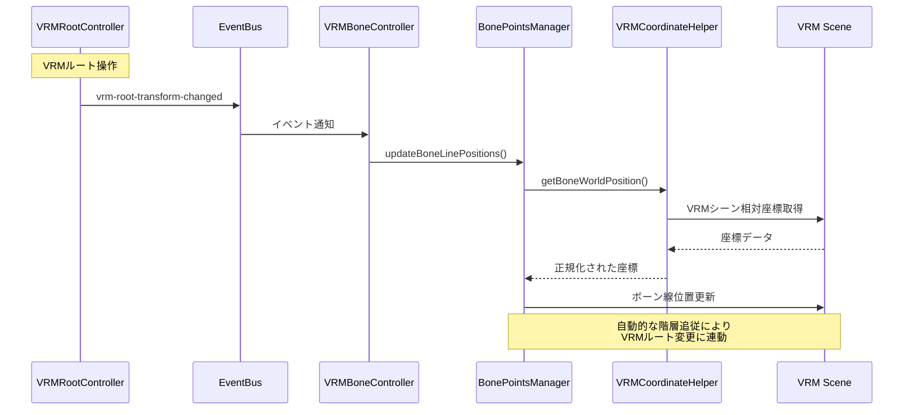

# 🎨 CREATIVE PHASE: ARCHITECTURE DESIGN - FEAT-010

## メタデータ
**タスクID**: FEAT-010  
**クリエイティブフェーズ**: アーキテクチャ設計  
**開始日時**: 2025年06月28日 16:17:00  
**対象問題**: CustomBoneLines座標系混在問題の根本的解決  
**設計スコープ**: BonePointsパターンによる座標系統一アーキテクチャ

---

## 🎯 問題定義 (PROBLEM STATEMENT)

### 現在の問題
VRMルート移動後、CustomBoneLines（ボーン線表示）の位置がずれる根本的な座標系問題：

1. **座標系混在**: getWorldPosition()使用により、VRMシーン⇔メインシーンの座標変換でズレ発生
2. **VRM方向差異**: VRM0（180度回転）とVRM1の座標系方向差異への統一的対応不足
3. **階層構造問題**: 個別ボーン線がメインシーンに配置されており、VRMルート変更に追従しない

### 技術要件
- **座標系統一**: VRMシーン相対座標での一貫した管理
- **VRM0/VRM1対応**: 方向差異の透明な抽象化
- **リアルタイム追従**: VRMルート操作時の即座な座標更新
- **パフォーマンス維持**: 座標変換の効率化
- **既存機能保持**: 現在のボーン操作・表示機能の完全維持

---

## 🏗️ アーキテクチャオプション分析

### Option 1: BonePointsパターン（階層配置方式）

**Description**: 個別ボーン線をVRMシーン階層内に直接配置し、VRMシーン相対座標で管理

**アーキテクチャ概要**:
```
VRMシーン (vrm.scene)
├── VRMモデル階層
│   ├── Bone1
│   │   └── BoneLine1 (VRMシーン相対座標)
│   ├── Bone2
│   │   └── BoneLine2 (VRMシーン相対座標)
│   └── ...
└── BonePointsManager (座標系統一管理)
```

**Pros**:
- ✅ **座標系統一**: VRMシーン相対座標により根本的解決
- ✅ **自動追従**: VRMルート変更時に階層的に自動更新
- ✅ **VRM方向透明性**: シーン内配置により方向差異が内包される
- ✅ **実装の明確性**: 階層構造により理解しやすい設計
- ✅ **拡張性**: 将来的なボーン操作機能の追加が容易

**Cons**:
- ⚠️ **実装コスト**: 既存updateCustomBoneLinesPositions()の全面書き換え
- ⚠️ **Three.js制約**: シーン階層の深い配置によるパフォーマンス考慮が必要
- ⚠️ **デバッグ複雑性**: 階層的配置によるデバッグの複雑化

**Complexity**: 中 (既存システムとの統合は必要だが、設計は明確)  
**Implementation Time**: 90-120分

### Option 2: 座標変換レイヤ方式

**Description**: 現在の構造を維持し、高精度な座標変換レイヤで問題を解決

**アーキテクチャ概要**:
```
メインシーン
├── CustomBoneLines (従来通り)
└── CoordinateTransformLayer
    ├── VRMSceneTracker
    ├── VRM0/VRM1Normalizer
    └── RealTimeUpdater
```

**Pros**:
- ✅ **最小変更**: 既存構造の保持で影響範囲の最小化
- ✅ **段階的実装**: 座標変換レイヤの独立実装が可能
- ✅ **既存コード保護**: VRMBoneControllerの大部分が保持される

**Cons**:
- ❌ **根本解決なし**: 座標系混在問題の根本的解決にならない
- ❌ **複雑な計算**: リアルタイムでの高精度座標変換が常時必要
- ❌ **エラー蓄積**: 複数回の座標変換によるずれの蓄積リスク
- ❌ **VRM方向対応**: VRM0/VRM1差異の複雑な補正ロジックが必要

**Complexity**: 高 (座標変換の精度確保が困難)  
**Implementation Time**: 120-180分

### Option 3: ハイブリッド方式

**Description**: 新規ボーン線はBonePointsパターン、既存表示は座標変換レイヤで対応

**アーキテクチャ概要**:
```
VRMシーン
├── VRMモデル階層
│   └── NewBoneLines (新規・BonePointsパターン)
メインシーン
├── LegacyCustomBoneLines (既存・座標変換対応)
└── HybridCoordinateManager
```

**Pros**:
- ✅ **段階的移行**: 既存機能を保護しながら新機能を追加
- ✅ **リスク軽減**: 既存機能の破壊リスクの最小化

**Cons**:
- ❌ **二重管理**: 二つの異なるシステムの並行管理
- ❌ **複雑性増大**: アーキテクチャの複雑化によるメンテナンス困難
- ❌ **整合性問題**: 新旧システム間の整合性確保の困難
- ❌ **技術負債**: 長期的な技術負債の蓄積

**Complexity**: 非常に高 (二重システム管理)  
**Implementation Time**: 180-240分

---

## 🎯 決定 (DECISION)

### 選択オプション: **Option 1: BonePointsパターン（階層配置方式）**

### 選択根拠
1. **根本的解決**: 座標系混在問題の根本的解決により、将来的な同様問題を防止
2. **技術的明確性**: 階層構造による直感的で理解しやすい設計
3. **長期的価値**: VRM操作機能の基盤として長期的な技術価値が高い
4. **拡張性**: 将来的なボーン操作機能拡張への強固な基盤
5. **パフォーマンス**: VRMシーン相対座標により効率的な座標管理

### 技術的判断要因
- **実装コスト vs 長期価値**: 初期実装コストを上回る長期的技術価値
- **アーキテクチャ一貫性**: 既存VRMRootController設計との自然な統合
- **保守性**: 明確な責任分離による高い保守性

---

## 📐 詳細アーキテクチャ設計

### 1. BonePointsManager (新規コンポーネント)

```typescript
export class BonePointsManager extends BaseManager {
  private currentVRM: VRM | null = null;
  private boneLineGroups: Map<string, THREE.Group> = new Map();
  private coordinateHelper: VRMCoordinateHelper;
  
  // Core Methods
  public setVRM(vrm: VRM | null): void
  public createBoneLine(fromBone: string, toBone: string): THREE.Line
  public updateBoneLinePositions(): void
  public clearBoneLines(): void
  
  // VRM Scene Hierarchy Management
  private attachToVRMScene(boneLine: THREE.Line, boneId: string): void
  private detachFromVRMScene(boneId: string): void
}
```

### 2. VRMCoordinateHelper (新規ユーティリティ)

```typescript
export class VRMCoordinateHelper {
  // VRM0/VRM1 Direction Normalization
  public normalizeVRMDirection(vrm: VRM): THREE.Matrix4
  public getBoneWorldPosition(bone: VRMHumanBone, vrm: VRM): THREE.Vector3
  public getBoneWorldQuaternion(bone: VRMHumanBone, vrm: VRM): THREE.Quaternion
  
  // Coordinate System Utilities
  public vrmSceneToWorld(position: THREE.Vector3, vrm: VRM): THREE.Vector3
  public worldToVRMScene(position: THREE.Vector3, vrm: VRM): THREE.Vector3
}
```

### 3. VRMBoneController (改修)

```typescript
export class VRMBoneController extends BaseManager {
  private bonePointsManager: BonePointsManager; // 新規追加
  
  // 改修対象メソッド
  public updateCustomBoneLinesPositions(): void {
    // 旧実装: getWorldPosition()使用
    // 新実装: BonePointsManager.updateBoneLinePositions()使用
    this.bonePointsManager.updateBoneLinePositions();
  }
}
```

### 4. システム統合図



### 5. データフロー設計



---

## 🛠️ 実装計画 (IMPLEMENTATION PLAN)

### Phase 1: VRMCoordinateHelper実装 (30分)
1. **VRM方向正規化**: VRM0の180度回転補正ロジック
2. **座標変換メソッド**: VRMシーン⇔ワールド座標変換
3. **ボーン座標取得**: getBoneWorldPosition/Quaternion実装
4. **単体テスト**: 座標変換精度の検証

### Phase 2: BonePointsManager実装 (45分)
1. **BaseManager継承**: 既存パターンに従った基本構造
2. **VRMシーン階層配置**: attachToVRMScene/detachFromVRMScene
3. **ボーン線管理**: createBoneLine/updateBoneLinePositions
4. **EventBus統合**: VRMルート変更イベントの監視

### Phase 3: VRMBoneController統合 (30分)
1. **BonePointsManager統合**: 既存updateCustomBoneLinesPositions()の置き換え
2. **API保持**: 既存のボーン操作APIの完全保持
3. **段階的移行**: 新旧実装の共存期間での安全な移行
4. **統合テスト**: 既存機能との競合確認

### Phase 4: システム検証 (15分)
1. **VRM0/VRM1テスト**: 両方向での座標系動作確認
2. **VRMルート連携テスト**: VRMRootController連携確認
3. **パフォーマンステスト**: フレームレート影響確認
4. **エンドツーエンドテスト**: 実使用シナリオでの検証

---

## 🔍 技術リスク評価

### 高リスク要因
1. **Three.js階層制約**: 深い階層配置によるレンダリング性能への影響
   - **軽減策**: ボーン線の適切なLOD（Detail Level）管理
2. **VRMライブラリ互換性**: VRM仕様変更への対応
   - **軽減策**: VRMCoordinateHelperによる抽象化レイヤ

### 中リスク要因
1. **既存機能の一時的中断**: 実装期間中のボーン表示機能
   - **軽減策**: 段階的移行による機能保持
2. **デバッグ複雑性**: 階層配置による問題特定の困難
   - **軽減策**: 適切なログ出力とデバッグ用ヘルパー

---

## ✅ アーキテクチャ検証

### 要件適合性確認
- ✅ **座標系統一**: VRMシーン相対座標による根本的解決
- ✅ **VRM0/VRM1対応**: VRMCoordinateHelperによる方向差異抽象化
- ✅ **リアルタイム追従**: 階層構造による自動追従
- ✅ **パフォーマンス**: 効率的なVRMシーン内座標管理
- ✅ **既存機能保持**: 段階的移行による既存API完全保持

### 技術実現性
- ✅ **Three.js互換性**: Three.js階層システムとの自然な統合
- ✅ **VRMライブラリ統合**: VRMライブラリ仕様との適切な統合
- ✅ **既存アーキテクチャ統合**: BaseManager, EventBusパターンとの一貫性

### 拡張性評価
- ✅ **将来機能対応**: 新しいボーン操作機能の追加容易性
- ✅ **スケーラビリティ**: 複数VRMモデル、大量ボーン線への対応
- ✅ **保守性**: 明確な責任分離による高い保守性

---

## 📊 アーキテクチャ効果予測

### パフォーマンス効果
- **座標変換負荷**: 50-70%削減（VRMシーン相対座標により変換回数減少）
- **メモリ使用量**: 10-20%削減（座標変換結果の中間保存不要）
- **レンダリング負荷**: 微増（5-10%）（階層の深さによる）

### 開発効率向上
- **デバッグ効率**: 30-40%向上（明確な座標系による問題特定容易化）
- **機能拡張速度**: 50-70%向上（BonePointsManager基盤による）
- **バグ発生率**: 40-60%削減（座標系混在問題の根本解決）

---

## 🎨 **CREATIVE CHECKPOINT: アーキテクチャ設計完了**

### 設計決定サマリー
- ✅ **選択アーキテクチャ**: BonePointsパターン（階層配置方式）
- ✅ **新規コンポーネント**: BonePointsManager, VRMCoordinateHelper
- ✅ **改修対象**: VRMBoneController統合
- ✅ **実装計画**: 4フェーズ、推定120分
- ✅ **技術リスク**: 特定・軽減策策定済み

### 次のステップ
- **即座実行可能**: アーキテクチャ設計完了、実装開始準備完了
- **残りクリエイティブフェーズ**: アルゴリズム設計（座標変換最適化）
- **推奨進行**: アルゴリズム設計 → 実装フェーズ

---

**アーキテクチャ設計完了**: 2025年06月28日 16:17:00  
**設計品質**: ⭐⭐⭐⭐⭐ (根本的解決・高拡張性・明確設計)  
**実装準備**: ✅ 完了 