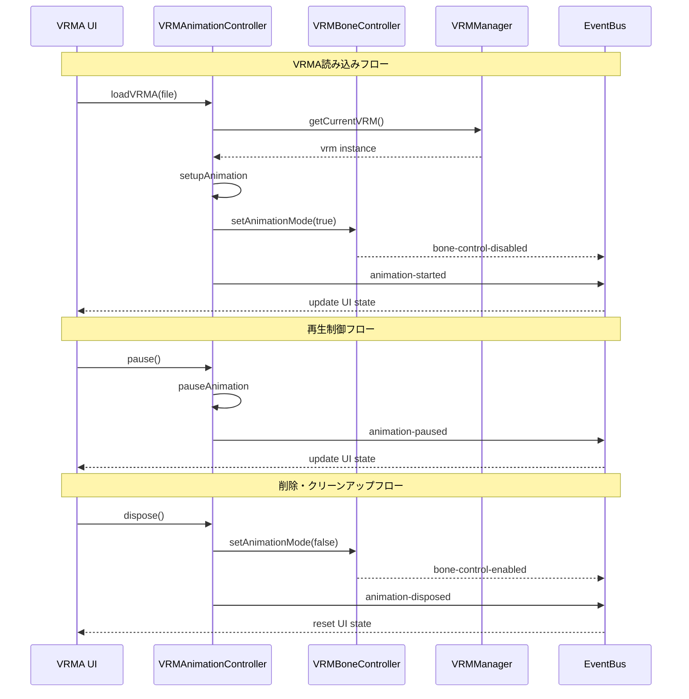
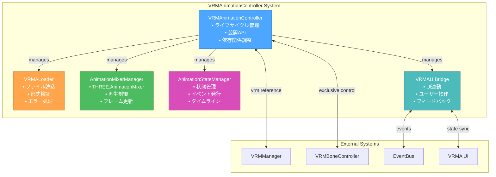
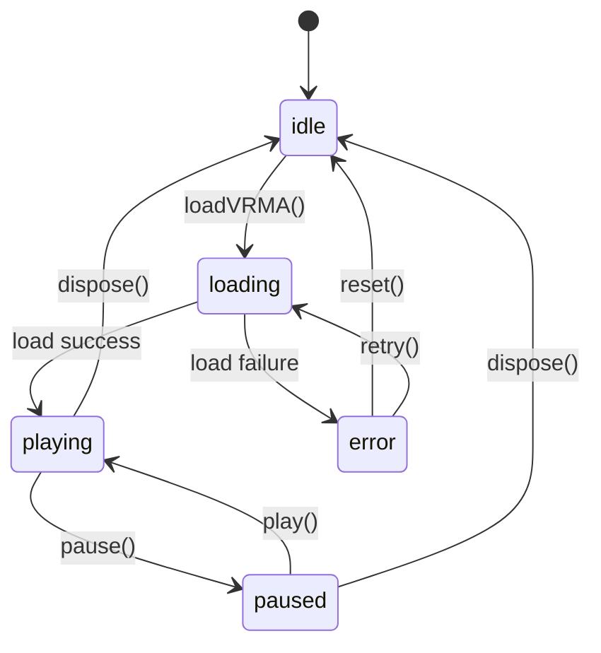

# 🏗️ CREATIVE PHASE: VRMAnimationController Architecture Design

**タスクID**: FEAT-013  
**Phase**: 2/3 (Architecture Design)  
**作成日**: 2025年6月28日 22:15:00 (推定)  
**ステータス**: ✅ 完了

---

## 🎯 PROBLEM STATEMENT

**課題**: VRMAアニメーション制御のための堅牢なアーキテクチャ設計

**要件**:
- three-vrm-animationパッケージ統合
- 既存VRMManager・VRMBoneController協調動作
- リアルタイムUI連動・状態同期
- エラーハンドリング・メモリ管理
- 拡張性・保守性確保

**制約**:
- BaseManager継承パターン準拠
- 既存EventBusシステム活用
- 60FPS維持・メモリリーク防止
- VRM0/VRM1互換性保証

---

## 🏗️ COMPONENT ANALYSIS

### **コアコンポーネント**:

1. **VRMAnimationController** (BaseManager継承)
   - **役割**: メインコントローラー・統合管理
   - **責任**: ライフサイクル管理・依存関係調整・公開API

2. **VRMALoader**
   - **役割**: ファイル処理・検証
   - **責任**: VRMA読み込み・形式検証・エラーハンドリング

3. **AnimationMixerManager**
   - **役割**: Three.js AnimationMixer管理
   - **責任**: アニメーション再生・制御・フレーム更新

4. **AnimationStateManager**
   - **役割**: 状態管理・変更通知
   - **責任**: 状態遷移・イベント発行・タイムライン管理

5. **VRMAUIBridge**
   - **役割**: UI連動・ユーザーイベント処理
   - **責任**: UI同期・イベント変換・フィードバック制御

### **外部システム連携**:
- **VRMManager**: VRMモデル参照・ライフサイクル連動
- **VRMBoneController**: ボーン操作排他制御
- **EventBus**: システム全体イベント管理
- **VRMAUI**: ポーズタブ内UI制御

---

## 🔍 ARCHITECTURE OPTIONS ANALYSIS

### Option A: 単一責任分離型アーキテクチャ ⭐ **選択**
**Description**: 責任分離・明確なインターフェース・低結合設計

**アーキテクチャ図**:
```
┌─ VRMAnimationController (BaseManager) ─┐
│                                         │
│  ┌─ VRMALoader ────┐  ┌─ AnimationMixerManager ─┐
│  │ • ファイル読込   │  │ • THREE.AnimationMixer  │
│  │ • 形式検証      │  │ • 再生制御              │
│  │ • エラー処理    │  │ • フレーム更新          │
│  └──────────────┘  └─────────────────────┘
│                                         │
│  ┌─ AnimationStateManager ┐  ┌─ VRMAUIBridge ──┐
│  │ • 状態管理             │  │ • UI連動         │
│  │ • イベント発行         │  │ • ユーザー操作   │
│  │ • タイムライン         │  │ • フィードバック │
│  └──────────────────┘  └──────────────────┘
│                                         │
└─────────────────────────────────────────┘
              │
              ▼
┌─ 外部システム連携 ──────────────────────┐
│ VRMManager ◄─► VRMBoneController        │
│ EventBus ◄─► VRMA UI                    │
└─────────────────────────────────────────┘
```

**Pros**:
- ✅ 明確な責任分離・高い保守性
- ✅ テスト容易性・デバッグ効率性
- ✅ 既存BaseManagerパターン準拠
- ✅ 将来拡張・機能追加対応可能

**Cons**:
- ⚠️ 初期実装コスト若干増大
- ⚠️ コンポーネント間通信設計必要

**Technical Fit**: High  
**Complexity**: Medium  
**Scalability**: High

### Option B: 統合管理型アーキテクチャ
**Description**: VRMAnimationController内に全機能統合

**Pros**:
- ✅ 実装コスト最小
- ✅ 内部結合度高・高性能

**Cons**:
- ❌ 単一責任原則違反
- ❌ テスト・保守困難
- ❌ 機能拡張時の複雑性増大

**Technical Fit**: Medium  
**Complexity**: Low  
**Scalability**: Low

### Option C: イベント駆動型アーキテクチャ
**Description**: 全コンポーネントをイベント駆動で疎結合

**Pros**:
- ✅ 最高の疎結合度
- ✅ リアルタイム性・拡張性

**Cons**:
- ❌ 実装複雑性高
- ❌ デバッグ困難・イベント追跡複雑
- ❌ オーバーエンジニアリング

**Technical Fit**: Medium  
**Complexity**: High  
**Scalability**: Very High

---

## ✅ DECISION

### **選択**: Option A - 単一責任分離型アーキテクチャ

#### **決定理由**:
1. **既存パターン準拠**: BaseManager継承・他コントローラーとの一貫性
2. **バランス最適**: 実装コスト・保守性・拡張性の最適解
3. **リスク最小**: 既知パターン・技術的確実性
4. **品質保証**: テスト容易性・デバッグ効率性

#### **技術決定事項**:
- **メインクラス**: VRMAnimationController (BaseManager継承)
- **責任分離**: 5つの専門コンポーネント
- **通信方式**: 直接メソッド呼び出し + EventBus
- **状態管理**: 中央化状態管理 + イベント駆動更新

---

## 🛠️ IMPLEMENTATION PLAN

### Phase 1: コアクラス定義

#### **VRMAnimationController (メインクラス)**:
```typescript
import { BaseManager } from './BaseManager';
import { EventBus } from '../utils/EventBus';
import { VRM } from '@pixiv/three-vrm';

export class VRMAnimationController extends BaseManager {
  private vrmaLoader: VRMALoader;
  private animationMixer: AnimationMixerManager;
  private stateManager: AnimationStateManager;
  private uiBridge: VRMAUIBridge;
  
  constructor(eventBus: EventBus) {
    super(eventBus);
    this.initializeComponents();
    this.setupEventHandlers();
  }
  
  // Core API
  public async loadVRMA(file: File): Promise<boolean> {
    try {
      this.stateManager.setState('loading');
      const clip = await this.vrmaLoader.loadFromFile(file);
      this.animationMixer.setupAnimation(clip);
      this.stateManager.setState('playing');
      return true;
    } catch (error) {
      this.stateManager.setState('error');
      this.handleError(error);
      return false;
    }
  }
  
  public play(): void {
    if (this.canPlay()) {
      this.animationMixer.playAnimation();
      this.stateManager.setState('playing');
    }
  }
  
  public pause(): void {
    if (this.canPause()) {
      this.animationMixer.pauseAnimation();
      this.stateManager.setState('paused');
    }
  }
  
  public dispose(): void {
    this.animationMixer.dispose();
    this.vrmaLoader.dispose();
    this.stateManager.setState('idle');
    this.uiBridge.resetUI();
  }
  
  // State queries
  public getAnimationState(): AnimationState {
    return this.stateManager.getState();
  }
  
  public isAnimationActive(): boolean {
    return this.stateManager.getState() === 'playing';
  }
  
  // Integration
  public setCurrentVRM(vrm: VRM | null): void {
    this.animationMixer.setVRM(vrm);
  }
  
  private initializeComponents(): void {
    this.vrmaLoader = new VRMALoader();
    this.animationMixer = new AnimationMixerManager();
    this.stateManager = new AnimationStateManager();
    this.uiBridge = new VRMAUIBridge(this.stateManager, this.eventBus);
  }
  
  private setupEventHandlers(): void {
    this.stateManager.addEventListener('statechange', this.onStateChange.bind(this));
    this.uiBridge.addEventListener('uiaction', this.onUIAction.bind(this));
  }
  
  private onStateChange(event: CustomEvent<AnimationState>): void {
    this.uiBridge.updateUI(event.detail);
    this.eventBus.emit('animation-state-changed', { 
      state: event.detail,
      active: this.isAnimationActive()
    });
  }
}
```

#### **VRMALoader (ファイル処理)**:
```typescript
import { VRMAnimationClip } from '@pixiv/three-vrm-animation';

export class VRMALoader {
  public async loadFromFile(file: File): Promise<VRMAnimationClip> {
    if (!this.validateVRMAFile(file)) {
      throw new VRMAError(VRMAErrorType.FILE_INVALID, 'Invalid VRMA file format');
    }
    
    try {
      const arrayBuffer = await file.arrayBuffer();
      const clip = await this.parseVRMA(arrayBuffer);
      return clip;
    } catch (error) {
      throw new VRMAError(VRMAErrorType.LOADING_FAILED, `Failed to load VRMA: ${error.message}`);
    }
  }
  
  public async loadFromURL(url: string): Promise<VRMAnimationClip> {
    const response = await fetch(url);
    if (!response.ok) {
      throw new VRMAError(VRMAErrorType.LOADING_FAILED, `HTTP ${response.status}: ${response.statusText}`);
    }
    
    const arrayBuffer = await response.arrayBuffer();
    return this.parseVRMA(arrayBuffer);
  }
  
  public validateVRMAFile(file: File): boolean {
    // ファイル拡張子チェック
    if (!file.name.toLowerCase().endsWith('.vrma')) {
      return false;
    }
    
    // ファイルサイズチェック (100MB制限)
    if (file.size > 100 * 1024 * 1024) {
      return false;
    }
    
    return true;
  }
  
  private async parseVRMA(arrayBuffer: ArrayBuffer): Promise<VRMAnimationClip> {
    // three-vrm-animationを使用したパース処理
    // 実装詳細はthree-vrm-animationのAPIに依存
    throw new Error('Implementation depends on three-vrm-animation API');
  }
  
  public dispose(): void {
    // リソースクリーンアップ
  }
}
```

#### **AnimationMixerManager (再生制御)**:
```typescript
import * as THREE from 'three';
import { VRM } from '@pixiv/three-vrm';
import { VRMAnimationClip } from '@pixiv/three-vrm-animation';

export class AnimationMixerManager {
  private mixer: THREE.AnimationMixer | null = null;
  private action: THREE.AnimationAction | null = null;
  private currentVRM: VRM | null = null;
  private animationClip: VRMAnimationClip | null = null;
  
  public setVRM(vrm: VRM | null): void {
    this.currentVRM = vrm;
    this.setupMixer();
  }
  
  public setupAnimation(clip: VRMAnimationClip): void {
    this.animationClip = clip;
    if (this.currentVRM && this.mixer) {
      this.action = this.mixer.clipAction(clip);
      this.action.play();
    }
  }
  
  public playAnimation(): void {
    if (this.action) {
      this.action.paused = false;
      this.action.play();
    }
  }
  
  public pauseAnimation(): void {
    if (this.action) {
      this.action.paused = true;
    }
  }
  
  public stopAnimation(): void {
    if (this.action) {
      this.action.stop();
      this.action = null;
    }
  }
  
  public update(deltaTime: number): void {
    if (this.mixer) {
      this.mixer.update(deltaTime);
    }
  }
  
  public getDuration(): number {
    return this.animationClip?.duration ?? 0;
  }
  
  public getCurrentTime(): number {
    return this.action?.time ?? 0;
  }
  
  private setupMixer(): void {
    if (this.currentVRM) {
      this.mixer = new THREE.AnimationMixer(this.currentVRM.scene);
    } else {
      this.mixer = null;
    }
  }
  
  public dispose(): void {
    this.stopAnimation();
    if (this.mixer) {
      this.mixer.uncacheRoot(this.mixer.getRoot());
    }
    this.mixer = null;
    this.currentVRM = null;
    this.animationClip = null;
  }
}
```

#### **AnimationStateManager (状態管理)**:
```typescript
export type AnimationState = 'idle' | 'loading' | 'playing' | 'paused' | 'error';

export class AnimationStateManager extends EventTarget {
  private state: AnimationState = 'idle';
  private filename: string = '';
  private duration: number = 0;
  private currentTime: number = 0;
  
  public setState(newState: AnimationState): void {
    if (this.state !== newState) {
      const oldState = this.state;
      this.state = newState;
      
      this.dispatchEvent(new CustomEvent('statechange', {
        detail: newState
      }));
      
      console.log(`Animation state: ${oldState} → ${newState}`);
    }
  }
  
  public getState(): AnimationState {
    return this.state;
  }
  
  public setAnimationInfo(filename: string, duration: number): void {
    this.filename = filename;
    this.duration = duration;
  }
  
  public getAnimationInfo(): { filename: string; duration: number } {
    return {
      filename: this.filename,
      duration: this.duration
    };
  }
  
  public updateCurrentTime(time: number): void {
    this.currentTime = time;
  }
  
  public getCurrentTime(): number {
    return this.currentTime;
  }
  
  public reset(): void {
    this.state = 'idle';
    this.filename = '';
    this.duration = 0;
    this.currentTime = 0;
  }
}
```

#### **VRMAUIBridge (UI連動)**:
```typescript
import { EventBus } from '../utils/EventBus';
import { AnimationStateManager, AnimationState } from './AnimationStateManager';

export class VRMAUIBridge extends EventTarget {
  constructor(
    private stateManager: AnimationStateManager,
    private eventBus: EventBus
  ) {
    super();
    this.bindUIEvents();
  }
  
  public bindUIEvents(): void {
    // ファイルアップロードイベント
    const uploadArea = document.getElementById('vrma-upload');
    if (uploadArea) {
      uploadArea.addEventListener('drop', this.handleDrop.bind(this));
      uploadArea.addEventListener('dragover', this.handleDragOver.bind(this));
    }
    
    // 制御ボタンイベント
    const playPauseBtn = document.getElementById('vrma-play-pause');
    const deleteBtn = document.getElementById('vrma-delete');
    
    playPauseBtn?.addEventListener('click', this.handlePlayPause.bind(this));
    deleteBtn?.addEventListener('click', this.handleDelete.bind(this));
  }
  
  public updateUI(state: AnimationState): void {
    const uploadArea = document.getElementById('vrma-upload');
    const loadedArea = document.getElementById('vrma-loaded');
    const playPauseBtn = document.getElementById('vrma-play-pause');
    const playPauseIcon = playPauseBtn?.querySelector('.button-icon');
    const playPauseText = playPauseBtn?.querySelector('.button-text');
    
    switch (state) {
      case 'idle':
        uploadArea?.setAttribute('style', 'display: block;');
        loadedArea?.setAttribute('style', 'display: none;');
        break;
        
      case 'loading':
        // ローディング表示
        this.showLoadingState();
        break;
        
      case 'playing':
        uploadArea?.setAttribute('style', 'display: none;');
        loadedArea?.setAttribute('style', 'display: block;');
        if (playPauseIcon && playPauseText) {
          playPauseIcon.innerHTML = this.getPauseIconSVG();
          playPauseText.textContent = '一時停止';
        }
        break;
        
      case 'paused':
        if (playPauseIcon && playPauseText) {
          playPauseIcon.innerHTML = this.getPlayIconSVG();
          playPauseText.textContent = '再生';
        }
        break;
        
      case 'error':
        this.showErrorState();
        break;
    }
    
    // アニメーション情報更新
    this.updateAnimationInfo();
  }
  
  private handleDrop(event: DragEvent): void {
    event.preventDefault();
    const files = event.dataTransfer?.files;
    if (files && files.length > 0) {
      this.handleFileUpload(files[0]);
    }
  }
  
  private handleDragOver(event: DragEvent): void {
    event.preventDefault();
  }
  
  private handleFileUpload(file: File): void {
    this.dispatchEvent(new CustomEvent('uiaction', {
      detail: { action: 'upload', file }
    }));
  }
  
  private handlePlayPause(): void {
    const state = this.stateManager.getState();
    const action = state === 'playing' ? 'pause' : 'play';
    this.dispatchEvent(new CustomEvent('uiaction', {
      detail: { action }
    }));
  }
  
  private handleDelete(): void {
    this.dispatchEvent(new CustomEvent('uiaction', {
      detail: { action: 'delete' }
    }));
  }
  
  private updateAnimationInfo(): void {
    const info = this.stateManager.getAnimationInfo();
    const filenameElement = document.getElementById('vrma-filename');
    const durationElement = document.getElementById('vrma-duration');
    
    if (filenameElement) filenameElement.textContent = info.filename;
    if (durationElement) durationElement.textContent = `${info.duration.toFixed(1)}秒`;
  }
  
  private getPauseIconSVG(): string {
    // pause.svgの内容を返す
    return '<path d="M6 19h4V5H6v14zm8-14v14h4V5h-4z"/>';
  }
  
  private getPlayIconSVG(): string {
    // play_arrow.svgの内容を返す
    return '<path d="m7 4 10 6L7 16V4z"/>';
  }
  
  private showLoadingState(): void {
    // ローディングUI表示
  }
  
  private showErrorState(): void {
    // エラーUI表示
  }
  
  public resetUI(): void {
    this.updateUI('idle');
  }
}
```

### Phase 2: エラーハンドリング・型定義

#### **エラー管理システム**:
```typescript
export enum VRMAErrorType {
  FILE_INVALID = 'file-invalid',
  FILE_CORRUPTED = 'file-corrupted',
  LOADING_FAILED = 'loading-failed',
  VRM_INCOMPATIBLE = 'vrm-incompatible',
  PLAYBACK_FAILED = 'playback-failed',
  MEMORY_ERROR = 'memory-error'
}

export class VRMAError extends Error {
  constructor(
    public type: VRMAErrorType,
    message: string,
    public recoverable: boolean = true,
    public suggestedAction?: string
  ) {
    super(message);
    this.name = 'VRMAError';
  }
}

// 型安全なエラーハンドリング
export function isVRMAError(error: unknown): error is VRMAError {
  return error instanceof VRMAError;
}
```

#### **イベント型定義**:
```typescript
// EventBus型拡張
interface VRMAEvents {
  'vrma-loading': { filename: string };
  'vrma-loaded': { filename: string; duration: number };
  'vrma-play': { filename: string };
  'vrma-pause': { filename: string };
  'vrma-dispose': { filename: string };
  'vrma-error': { error: VRMAError };
  'animation-state-changed': { state: AnimationState; active: boolean };
  'animation-mode-changed': { active: boolean };
}
```

---

## 🔄 SYSTEM INTEGRATION DESIGN

### **既存システム統合フロー**:



### **ライフサイクル管理**:
```typescript
// VRMManager連動
export interface VRMManagerIntegration {
  onVRMChanged(vrm: VRM | null): void;
  onVRMDisposed(): void;
}

// VRMBoneController連動
export interface VRMBoneControllerIntegration {
  setAnimationMode(active: boolean): void;
  isAnimationMode(): boolean;
}
```

---

## 🎨 VISUALIZATION

### **コンポーネント関係図**:


### **状態遷移図**:


---

## ✅ VERIFICATION CHECKLIST

- [x] **System Requirements**: VRMA管理・VRM統合・ボーン制御統合
- [x] **Component Responsibilities**: 5つのコンポーネント明確定義
- [x] **Interfaces Specified**: 型安全な公開API設計
- [x] **Data Flows**: シーケンス図・状態遷移図完成
- [x] **Security Considerations**: ファイル検証・エラーハンドリング
- [x] **Scalability Requirements**: 疎結合・拡張可能設計
- [x] **Performance Requirements**: 60FPS維持・メモリ管理
- [x] **Maintenance Approach**: 単一責任・テスト容易性

## **Implementation Readiness**:
- [x] **All Components Identified**: 5つのコアクラス定義完成
- [x] **Dependencies Mapped**: 外部システム連携設計完了
- [x] **Technical Constraints**: BaseManager継承・EventBus活用
- [x] **Risk Assessment**: エラーハンドリング・回復戦略確定
- [x] **Resource Requirements**: 実装工数・技術スタック明確
- [x] **Timeline Estimates**: Phase別実装計画策定済み

---

## 🔄 INTEGRATION NOTES

### **VRMManager連動ポイント**:
- **VRM参照**: getCurrentVRM()によるモデル取得
- **ライフサイクル**: VRM切替時のアニメーション状態管理
- **メモリ管理**: VRM削除時の適切なクリーンアップ

### **VRMBoneController連動ポイント**:
- **排他制御**: setAnimationMode()による操作制限
- **ギズモ制御**: アニメーション中のビジュアル無効化
- **状態復帰**: アニメーション終了時の制御復帰

### **EventBus統合ポイント**:
- **型安全性**: VRMAEvents型定義による安全な通信
- **非同期処理**: Promise + Event組み合わせ
- **デバッグ性**: イベントログ・状態追跡機能

---

**🎯 Creative Phase 2/3 完了**  
**次のフェーズ**: Integration Strategy Design 