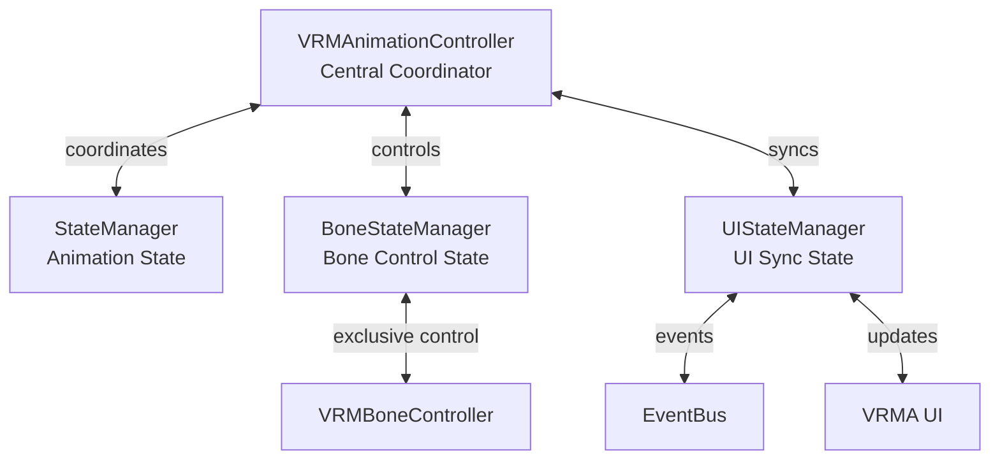

# ⚙️ CREATIVE PHASE: Integration Strategy Design

**タスクID**: FEAT-013  
**Phase**: 3/3 (Integration Strategy Design)  
**作成日**: 2025年6月28日 22:30:00 (推定)  
**ステータス**: ✅ 完了

---

## 🎯 PROBLEM STATEMENT

**課題**: VRMAシステムと既存VRMシステムの安全で効率的な統合戦略

**要件**:
- アニメーション⇔ボーン制御の排他制御
- UI状態の3軸同期（アニメーション・ボーン・UI）
- メモリ・パフォーマンス管理
- エラー回復・Graceful Degradation

---

## 🔍 INTEGRATION OPTIONS ANALYSIS

### Option A: 中央制御協調型統合 ⭐ **選択**
**Description**: VRMAnimationControllerが統合制御の中央ハブとして機能

**Pros**:
- ✅ 明確な責任分離・制御統一
- ✅ 状態不整合リスク最小化
- ✅ デバッグ・トラブルシューティング容易

**Cons**:
- ⚠️ 中央制御の複雑性増大

**Complexity**: Medium-High  
**Reliability**: High

### Option B: イベント駆動分散型統合
**Cons**:
- ❌ 状態同期複雑性極大
- ❌ デバッグ困難

### Option C: 単純排他制御型統合
**Cons**:
- ❌ 拡張性低・エラー回復不足

---

## ✅ DECISION

### **選択**: Option A - 中央制御協調型統合

#### **決定理由**:
1. **信頼性重視**: 状態不整合リスク最小化
2. **保守性確保**: 明確な責任分離
3. **拡張対応**: 将来機能追加対応可能

---

## 🛠️ IMPLEMENTATION PLAN

### 1. 排他制御システム
```typescript
// VRMBoneController拡張
interface IntegrationController {
  setAnimationMode(active: boolean): Promise<void>;
  getCurrentMode(): 'animation' | 'bone' | 'transitioning';
  canSwitchMode(): boolean;
}

class VRMBoneController extends BaseManager implements IntegrationController {
  private animationMode: boolean = false;
  
  public async setAnimationMode(active: boolean): Promise<void> {
    if (active) {
      await this.disableBoneControls();
      this.hideGizmos();
    } else {
      await this.enableBoneControls(); 
      this.showGizmos();
    }
    this.animationMode = active;
  }
}
```

### 2. 統合状態管理
```typescript
interface IntegrationState {
  animationActive: boolean;
  boneControlActive: boolean;
  uiState: 'bone-control' | 'animation-control' | 'transitioning';
  transitioning: boolean;
}

class IntegrationStateManager extends EventTarget {
  public async transitionToAnimationMode(vrmaInfo: VRMAInfo): Promise<void> {
    // Phase 1: ボーン制御無効化
    await this.notifyBoneControlDisable();
    // Phase 2: アニメーション開始
    await this.activateAnimation(vrmaInfo);
    // Phase 3: UI更新
    await this.updateUIToAnimationMode(vrmaInfo);
  }
}
```

### 3. エラー回復戦略
```typescript
type RecoveryStrategy = 
  | 'rollback-to-bone'
  | 'retry-animation'  
  | 'graceful-degradation';

class IntegrationErrorRecovery {
  public async handleIntegrationError(error: Error): Promise<RecoveryResult> {
    switch (this.analyzeError(error)) {
      case 'animation-failed':
        return await this.rollbackToBoneControl();
      case 'memory-exhausted':
        return await this.enableDegradedMode();
      default:
        return await this.performSafeReset();
    }
  }
}
```

### 4. メモリ管理
```typescript
class VRMAResourceManager {
  private memoryThreshold = 512 * 1024 * 1024; // 512MB
  
  public async loadVRMA(file: File): Promise<VRMAnimationClip> {
    await this.checkMemoryAvailability(file.size);
    await this.cleanupOldResources();
    const clip = await this.loadVRMAFile(file);
    this.registerResource(file.name, clip);
    return clip;
  }
}
```

---

## 🎨 INTEGRATION ARCHITECTURE



---

## ✅ VERIFICATION CHECKLIST

- [x] **排他制御**: アニメーション⇔ボーン制御の安全な切り替え
- [x] **状態同期**: 3軸状態管理システム設計
- [x] **エラー回復**: 4つの回復戦略定義
- [x] **メモリ管理**: リソース管理・最適化戦略
- [x] **パフォーマンス**: 60FPS維持・レスポンス確保
- [x] **拡張性**: 将来機能追加対応アーキテクチャ

---

## 🔄 INTEGRATION NOTES

### **核心統合ポイント**:
1. **VRMBoneController.setAnimationMode()**: 排他制御の核心API
2. **IntegrationStateManager**: 3軸状態の中央管理
3. **VRMAResourceManager**: メモリ・パフォーマンス管理
4. **IntegrationErrorRecovery**: 堅牢なエラー回復システム

### **実装優先度**:
1. **Phase 1**: 基本排他制御（最重要）
2. **Phase 2**: 状態同期システム
3. **Phase 3**: エラー回復・メモリ管理
4. **Phase 4**: パフォーマンス最適化

---

**🎯 Creative Phase 3/3 完了**  
**全Creative Phases終了**: UI/UX + Architecture + Integration Strategy ✅ 