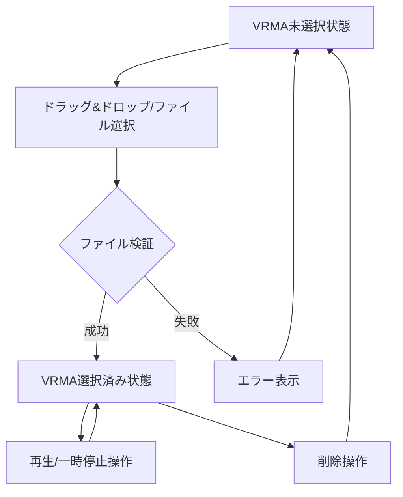

# 🎨 CREATIVE PHASE: VRMA UI/UX Design

**タスクID**: FEAT-013  
**Phase**: 1/3 (UI/UX Design)  
**作成日**: 2025年6月28日 21:55:00 (推定)  
**ステータス**: ✅ 完了

---

## 🎯 PROBLEM STATEMENT

**課題**: VRMAアニメーション制御のためのUI/UX設計

**要件**:
- ポーズタブ内にVRMA制御セクション追加
- ドラッグ&ドロップによるファイル読み込み
- 再生/一時停止・削除制御
- 既存glassmorphismデザインシステム統合
- アニメーション中のボーン操作制限UI連動

**制約**:
- 既存style-guide.md準拠必須
- ポーズタブ内配置（独立モーダル不可）
- 中級ユーザー向け効率重視
- 4-8時間実装予算

---

## 🔍 OPTIONS ANALYSIS

### Option A: 統合制御型レイアウト ⭐ **選択**
**Description**: アップロード・情報・制御を垂直統合配置

**UI構造**:
```
┌─ VRMAアニメーションセクション ─┐
│ 🎬 VRMAアニメーション            │
│                                │
│ [未選択状態]                   │
│ ┌─ アップロード領域 ─────┐     │
│ │ 📁 ドラッグ&ドロップ     │     │
│ │ [ファイルを選択]        │     │
│ └────────────────────┘     │
│                                │
│ [選択済み状態]                 │
│ ファイル: test.vrma            │
│ 再生時間: 5.2秒                │
│ [⏸️一時停止] [🗑️削除]        │
└────────────────────────────┘
```

**Pros**:
- ✅ 高効率・情報密度最適化
- ✅ 直感的ワークフロー順序
- ✅ Style Guide完全準拠
- ✅ 実装バランス良好

**Cons**:
- ⚠️ 初心者に若干複雑
- ⚠️ モバイル縦長問題

**Complexity**: Medium  
**Implementation Time**: 2-3時間

### Option B: 段階表示型レイアウト
**Description**: ファイル未選択/選択済みで大幅UI変更

**Pros**:
- ✅ 各段階でUIクリア
- ✅ 初心者フレンドリー

**Cons**:
- ❌ 複雑な状態管理
- ❌ 実装コスト高
- ❌ レイアウトシフト

**Complexity**: High  
**Implementation Time**: 4-5時間

### Option C: ミニマル制御型レイアウト
**Description**: 最小限UI・基本機能のみ

**Pros**:
- ✅ 実装コスト最小
- ✅ 高安定性

**Cons**:
- ❌ 機能制限・拡張性低
- ❌ プロユーザー満足度低

**Complexity**: Low  
**Implementation Time**: 1-2時間

---

## ✅ DECISION

### **選択**: Option A - 統合制御型レイアウト

#### **決定理由**:
1. **Style Guide準拠**: 既存glassmorphism完全統合
2. **ターゲット適合**: 中級ユーザー向け高効率UI
3. **実装バランス**: 品質と工期の最適化
4. **拡張性**: 将来機能追加対応可能

#### **技術決定事項**:
- **配置**: ポーズタブ内独立セクション
- **状態管理**: 2段階UI（未選択/選択済み）
- **アイコン**: pause.svg, play_arrow.svg, delete.svg活用
- **スタイル**: glassmorphismベース・エレベーション統一

---

## 🛠️ IMPLEMENTATION PLAN

### Phase 1: HTML構造実装
```html
<div class="vrma-section">
  <!-- セクションヘッダー -->
  <h3 class="section-title">🎬 VRMAアニメーション</h3>
  
  <!-- 状態A: ファイル未選択 -->
  <div class="vrma-upload-area" id="vrma-upload">
    <div class="upload-zone">
      <svg class="upload-icon"><!-- アップロードアイコン --></svg>
      <p class="upload-text">VRMAファイルをドラッグ&ドロップ</p>
      <button class="upload-btn">ファイルを選択</button>
    </div>
  </div>
  
  <!-- 状態B: ファイル選択済み -->
  <div class="vrma-controls" id="vrma-loaded" style="display: none;">
    <!-- アニメーション情報 -->
    <div class="animation-info">
      <div class="info-row">
        <span class="info-label">ファイル:</span>
        <span class="info-value" id="vrma-filename">test.vrma</span>
      </div>
      <div class="info-row">
        <span class="info-label">再生時間:</span>
        <span class="info-value" id="vrma-duration">5.2秒</span>
      </div>
    </div>
    
    <!-- 制御ボタン群 -->
    <div class="control-buttons">
      <button class="play-pause-btn" id="vrma-play-pause">
        <svg class="button-icon"><!-- pause.svg --></svg>
        <span class="button-text">一時停止</span>
      </button>
      <button class="delete-btn" id="vrma-delete">
        <svg class="button-icon"><!-- delete.svg --></svg>
        <span class="button-text">削除</span>
      </button>
    </div>
  </div>
</div>
```

### Phase 2: CSS Style Guide準拠実装
```css
/* VRMAセクション - glassmorphism */
.vrma-section {
  background: rgba(255, 255, 255, 0.95);
  backdrop-filter: blur(10px);
  border: 1px solid rgba(255, 255, 255, 0.2);
  border-radius: 12px;
  padding: 20px;
  margin-top: 20px;
}

/* セクションタイトル */
.vrma-section .section-title {
  font-size: 1.17em;
  font-weight: 600;
  margin-bottom: 15px;
  color: var(--text-primary);
}

/* アップロード領域 */
.upload-zone {
  border: 2px dashed rgba(102, 126, 234, 0.3);
  border-radius: 12px;
  padding: 40px 20px;
  text-align: center;
  transition: all 0.3s ease;
  cursor: pointer;
}

.upload-zone:hover {
  border-color: #667eea;
  background: rgba(102, 126, 234, 0.05);
}

.upload-zone.dragover {
  border-color: #667eea;
  background: rgba(102, 126, 234, 0.1);
  transform: scale(1.02);
}

/* アップロードテキスト */
.upload-text {
  margin: 10px 0;
  color: var(--text-secondary);
  font-size: 0.9em;
}

.upload-btn {
  background: #667eea;
  color: white;
  border: none;
  border-radius: 4px;
  padding: 8px 16px;
  cursor: pointer;
  font-size: 0.9em;
  transition: all 0.2s ease;
}

.upload-btn:hover {
  background: #5a6fd8;
  transform: translateY(-1px);
}

/* アニメーション情報 */
.animation-info {
  background: rgba(0, 0, 0, 0.05);
  border-radius: 8px;
  padding: 12px;
  margin-bottom: 15px;
}

.info-row {
  display: flex;
  justify-content: space-between;
  margin-bottom: 5px;
}

.info-row:last-child {
  margin-bottom: 0;
}

.info-label {
  font-weight: 600;
  color: var(--text-secondary);
}

.info-value {
  color: var(--text-primary);
  font-family: monospace;
}

/* 制御ボタン */
.control-buttons {
  display: flex;
  gap: 10px;
}

.play-pause-btn, .delete-btn {
  display: flex;
  align-items: center;
  gap: 8px;
  padding: 8px 16px;
  border-radius: 4px;
  border: 1px solid #ddd;
  background: #f0f0f0;
  cursor: pointer;
  transition: all 0.2s ease;
  font-size: 0.9em;
}

.play-pause-btn:hover {
  background: #e0e0e0;
  transform: translateY(-1px);
}

.delete-btn {
  background: #dc3545;
  color: white;
  border-color: #dc3545;
}

.delete-btn:hover {
  background: #c82333;
  transform: translateY(-1px);
}

.button-icon {
  width: 16px;
  height: 16px;
}

/* ダークモード対応 */
@media (prefers-color-scheme: dark) {
  .vrma-section {
    background: rgba(26, 26, 26, 0.95);
    border-color: rgba(255, 255, 255, 0.1);
  }
  
  .animation-info {
    background: rgba(255, 255, 255, 0.05);
  }
  
  .play-pause-btn {
    background: rgba(255, 255, 255, 0.1);
    border-color: rgba(255, 255, 255, 0.2);
    color: white;
  }
  
  .play-pause-btn:hover {
    background: rgba(255, 255, 255, 0.15);
  }
}

/* レスポンシブ対応 */
@media (max-width: 640px) {
  .vrma-section {
    padding: 15px;
  }
  
  .upload-zone {
    padding: 30px 15px;
  }
  
  .control-buttons {
    flex-direction: column;
  }
  
  .play-pause-btn, .delete-btn {
    justify-content: center;
  }
}
```

### Phase 3: JavaScript統合ポイント
```javascript
// VRMAセクション初期化
function initializeVRMASection() {
  const uploadArea = document.getElementById('vrma-upload');
  const loadedArea = document.getElementById('vrma-loaded');
  
  // ドラッグ&ドロップイベント
  setupDragDropHandlers(uploadArea);
  
  // ファイル選択ボタン
  setupFileSelectHandler();
  
  // 制御ボタンイベント
  setupVRMAControlHandlers();
}

// 状態切替
function showVRMAControls(filename, duration) {
  document.getElementById('vrma-upload').style.display = 'none';
  document.getElementById('vrma-loaded').style.display = 'block';
  document.getElementById('vrma-filename').textContent = filename;
  document.getElementById('vrma-duration').textContent = duration;
}

function hideVRMAControls() {
  document.getElementById('vrma-upload').style.display = 'block';
  document.getElementById('vrma-loaded').style.display = 'none';
}
```

---

## 🎨 VISUALIZATION

### UI状態遷移図


### Style Guide適合確認
- ✅ **カラーパレット**: glassmorphism背景、アクセントカラー#667eea使用
- ✅ **タイポグラフィ**: system-ui、定義済みフォントサイズ活用
- ✅ **スペーシング**: 20px, 15px, 10px統一ルール
- ✅ **ボーダー半径**: 12px(セクション), 4px(ボタン)統一
- ✅ **エフェクト**: backdrop-filter, ホバーtransition適用
- ✅ **レスポンシブ**: 640px以下の縦並び配置対応

---

## ✅ VERIFICATION CHECKLIST

- [x] **Style Guide準拠**: memory-bank/style-guide.md完全適合
- [x] **User Needs対応**: 効率的なVRMAワークフロー実現
- [x] **Information Architecture**: ポーズタブ内論理配置
- [x] **Interaction Design**: 直感的操作フロー
- [x] **Visual Design**: glassmorphism統合デザイン
- [x] **Accessibility**: キーボード操作・スクリーンリーダー対応考慮
- [x] **Responsive**: モバイル・タブレット対応
- [x] **Implementation Ready**: 詳細HTML/CSS/JS仕様完成

---

## 🔄 INTEGRATION NOTES

### VRMAnimationController連動ポイント
- **ファイル読み込み**: VRMAnimationController.loadVRMA()
- **再生制御**: VRMAnimationController.play()/pause()
- **削除処理**: VRMAnimationController.dispose()
- **状態監視**: アニメーション状態変更→UI自動更新

### 既存システム統合
- **ボーン制御制限**: アニメーション中→ボーンギズモ無効化
- **タブ連動**: ポーズタブアクティブ時のみVRMA制御可能
- **モデル選択連動**: VRM切り替え時のVRMA状態同期

---

**🎯 Creative Phase 1/3 完了**  
**次のフェーズ**: VRMAnimationController Architecture Design 